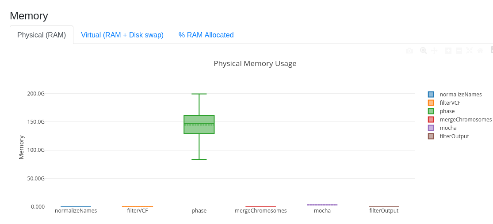
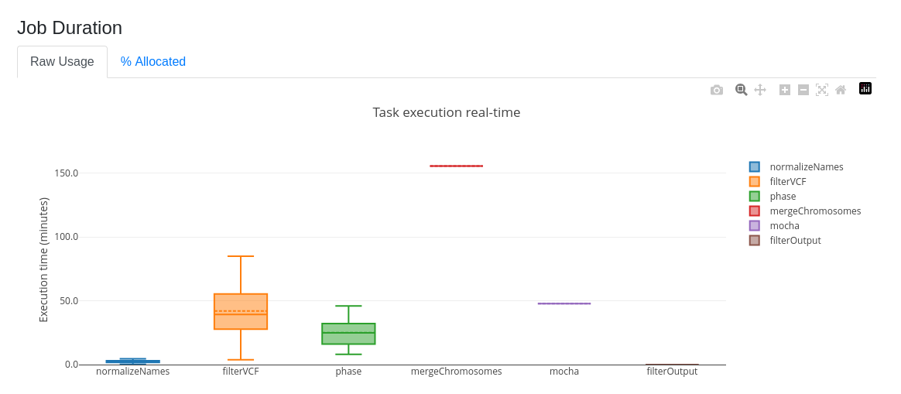
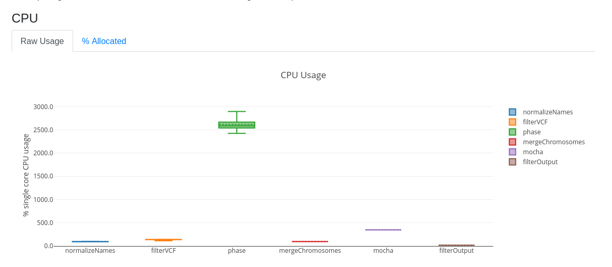

# MosaicCNV-Caller


### A Nextflow pipeline for running MoChA on WGS SNV data for detecting mosaic CNVs, UPDs and general large chromosomal alterations.  

## Requirements:

 - Nextflow 25.06.04+
 - apptainer 

## Installation:

We recommend downloading from github:

```bash
git clone https://github.com/JacquemontLab/MosaicCNV-Caller.git
```

Resources for both MoChA and BEAGLE require are extensive and require formatting. Expect to use ~16G of disk space. A nextflow script has been developed to help acquire them:

```bash
nextflow run download_resources.nf -output ./resources -profile apptainer 
```

## Usage:

```bash
nextflow run main.nf --vcf_samplefile /path/to/sampleFile.csv --dataset_name "Cohort" -profile apptainer 
```

### Parameters:


| Parameter | Description | Type | Default | Required | Hidden |
|-----------|-----------|-----------|-----------|-----------|-----------|
| `genome_version` | Genome version of input VCF (Only GRCh38 currently supported) | `string` | GRCh38 | True  |  |
| `vcf_samplefile` | Path to the vcf sample-file  | `string` |  | True |  |
| `impute` | Flag if you require the VCFs to be imputed.  | `boolean` | False | True |  |
| `mocha_resources` | Path to structured resources required by MoChA | `string` | ./resources/GRCh38/mocha | True |  |
| `beagle_resources` | Path to structured resources required by BEAGLE  | `string` | ./resources/GRCh38/beagle | True |  |
|  `dataset_name` | Name for dataset which structures results directory. | `string` | | True

### vcf_samplefile definition

A two-column csv file with columns **Path** and **Chr** respectively. The bash script `make_sampleFile.sh` can be used to help facilitate making it.

```txt
Path,Chr
/absolute/path/to/subset.19.vcf.gz,chr19
/absolute/path/to/subset_22.vcf.gz,chr22
```

### VCF Minimal Requirements

This follows the minimal entry field requirements stipulated by MoChA. The VCF needs to be split per chromosome as indicated by the sample-file.

```txt
##fileformat=VCFv4.2
##INFO=<ID=AC,Number=A,Type=Integer,Description="ALT allele count">
##FORMAT=<ID=GT,Number=1,Type=String,Description="Genotype">
##FORMAT=<ID=AD,Number=R,Type=Integer,Description="Allelic depths for the ref and alt alleles in the order listed">
#CHROM	POS	ID	REF	ALT	QUAL	FILTER	INFO	FORMAT	NA12878
1	752566	rs3094315	G	A	.	.	AC=2	GT:AD	1|1:0,31
1	776546	rs12124819	A	G	.	.	AC=1	GT:AD	0|1:21,23
1	798959	rs11240777	G	A	.	.	AC=0	GT:AD	0|0:31,0
1	932457	rs1891910	G	A	.	.	AC=1	GT:AD	1|0:18,14
```


### Output 

- Raw CNV calls are stored in `mosaic_calls.tsv` and their associated stats in `mosaic_stats.tsv`. We invite users to refer to the MoChA git for reference of column definitions: https://github.com/freeseek/mocha. 

- A filtered, transformed output is provided at `mosaicDB.tsv` to capture mosaic events only. The following filter logic is applied to remove germline-line variants as performed by Li et al. (https://www.nature.com/articles/s41586-018-0321-x). 

    - `Relative_Coverage` must be less than 2.1 OR `BAF_Deviation` must be less than 0.05. This eliminates strong potential germline signals.
    - For variants greater than 500KB in size, `Relative_Coverage` must be less than 2.5 AND `BAF_Deviation` must be less than 0.1.
    - For variants greater than 5MB in size, `BAF_Deviation` must be less than 0.15.

| Column | Definition |
|---|---|
| **SampleID** | Sample identifier for the mosaic event. |
| **Chr** | Chromosome of the event. |
| **Start** | Genomic start coordinate of the segment. |
| **End** | Genomic end coordinate of the segment. |
| **Length** | Segment size in base pairs (End − Start). |
| **Type** | Event class: DUP or DEL |
| **Cell_Fraction** | Estimated proportion of cells carrying the event. |
| **Relative_Copy_Number** | Estimated local copy number relative to diploid baseline. |
| **BAF_Deviation** | Magnitude of allelic imbalance at het sites in the segment. |
| **LOD_BAF_Phase_Score** | Log-odds confidence score for the phased BAF deviation call. |
| **P_Arm_Event** | Whether the event overlaps the chromosome's p arm. |
| **Q_Arm_Event** | Whether the event overlaps the chromosome's q arm. |
| **Whole_Chromosome** | Whether the event spans the entire chromosome. |

### Configuration

Nextflow pipelines often requires configuration specific to your cluster. In particular the `phase` process can consume signficant amounts of ram. Here is a sample run for 743 individuals.


The `nextflow.config` has process definitions for each process.  See how to edit configurations to fit your cluster at: https://docs.seqera.io/nextflow/config
### Memory 



### Duration



### CPU




## Citations:


```
Loh P., Genovese G., McCarroll S., Price A. et al. Insights about clonal expansions from 8,342 mosaic
chromosomal alterations. Nature 559, 350–355 (2018). [PMID: 29995854] [DOI: 10.1038/s41586-018-0321-x]

Loh P., Genovese G., McCarroll S., Monogenic and polygenic inheritance become
instruments for clonal selection (2020). [PMID: 32581363] [DOI: 10.1038/s41586-020-2430-6]

B L Browning, X Tian, Y Zhou, and S R Browning (2021) Fast two-stage phasing of large-scale sequence data. Am J Hum Genet 108(10):1880-1890. doi:10.1016/j.ajhg.2021.08.005 
```